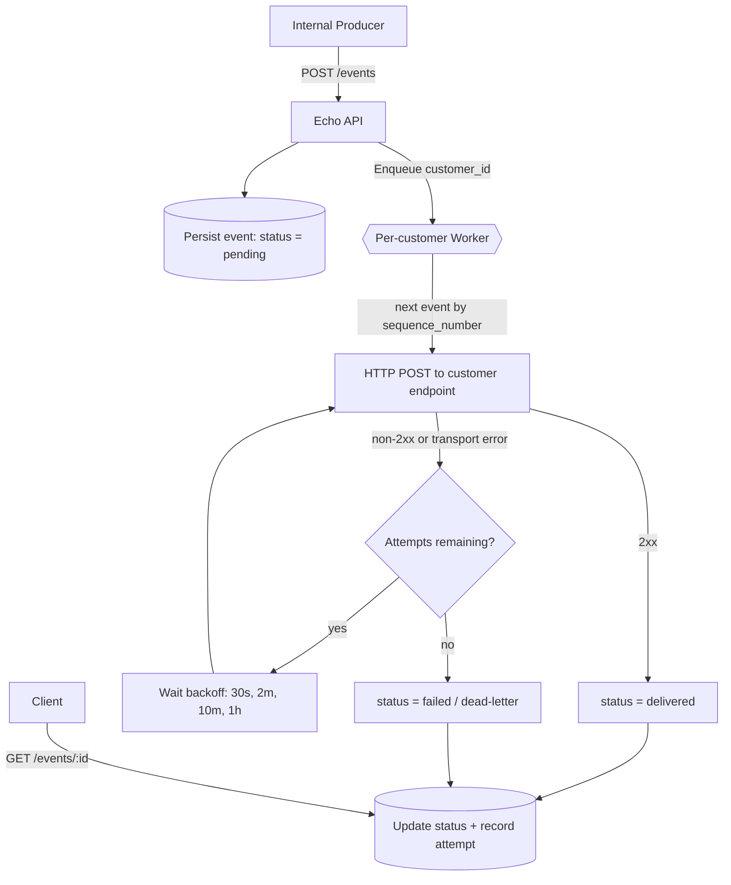
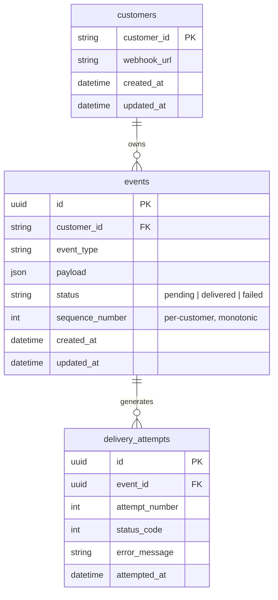
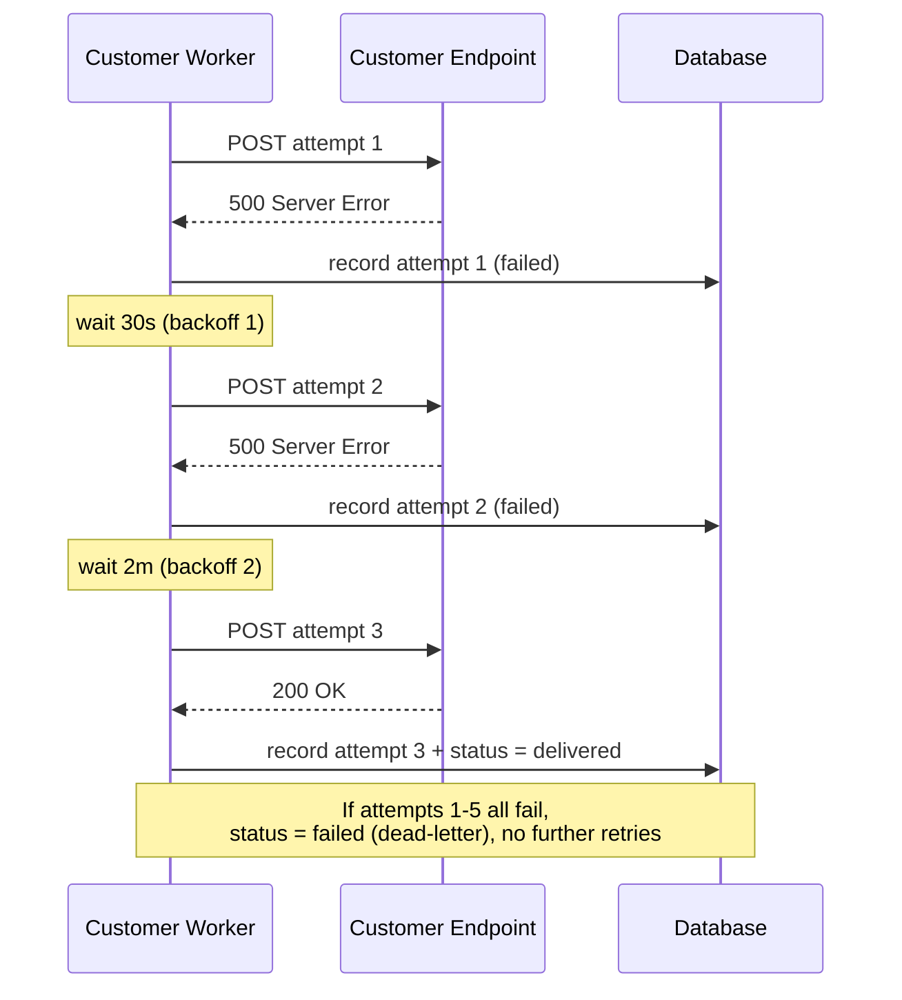

# webhook-relay

> A reliable webhook delivery service — accepts events from internal producers and delivers them to customer-registered HTTP endpoints with retries, per-customer ordering, and full delivery tracking.


## Summary

Internal services produce events (e.g. `order.created`) that external customers want delivered to their own HTTP endpoints. This relay accepts each event, persists it, and hands off delivery to a dedicated per-customer worker that retries with exponential backoff until the event is delivered or dead-lettered — so a producer never blocks on a slow customer, and a customer with a downed endpoint never affects anyone else. Every event carries a unique `event_id` for at-least-once delivery with client-side idempotency.

## Table of Contents

- [System Flow](#system-flow)
- [Database Schema (ERD)](#database-schema-erd)
- [Retry Sequence](#retry-sequence)
- [API Endpoints](#api-endpoints)
- [Project Structure](#project-structure)
- [Getting Started](#getting-started)
- [Design Decisions](#design-decisions)
- [Testing](#testing)
- [Author](#author)

## System Flow



## Database Schema (ERD)



## Retry Sequence

Two failed attempts, then recovery. If the schedule is fully exhausted instead, the event is dead-lettered (`status = failed`).



## API Endpoints

| Method | Path | Description |
|--------|------|-------------|
| `POST` | `/events` | Accept a new event from a producer; persist as `pending` and hand off to the customer's queue. Returns immediately. |
| `GET` | `/events/{event_id}` | Return an event's status and its full delivery-attempt history. |
| `GET` | `/events?customer_id=&status=` | List/filter events (both query params optional). |
| `POST` | `/customers/{customer_id}/endpoint` | Register or update a customer's webhook URL. |

### `POST /events`

**Request**
```json
{
  "customer_id": "cust-123",
  "event_type": "order.created",
  "payload": { "order_id": "A1", "total": 42 }
}
```

**Response** — `202 Accepted`
```json
{
  "event_id": "f69de018-58b2-4e65-aea1-0c3f7b39f94b",
  "status": "pending",
  "sequence_number": 1
}
```

### `GET /events/{event_id}`

**Response** — `200 OK`
```json
{
  "id": "f69de018-58b2-4e65-aea1-0c3f7b39f94b",
  "customer_id": "cust-123",
  "event_type": "order.created",
  "payload": { "order_id": "A1", "total": 42 },
  "status": "delivered",
  "sequence_number": 1,
  "created_at": "2026-07-14T10:05:58Z",
  "updated_at": "2026-07-14T10:05:59Z",
  "delivery_attempts": [
    {
      "id": "bdee28b3-1515-41bf-b7ee-4814b06ad5c3",
      "event_id": "f69de018-58b2-4e65-aea1-0c3f7b39f94b",
      "attempt_number": 1,
      "status_code": 200,
      "attempted_at": "2026-07-14T10:05:58Z"
    }
  ]
}
```
> On a failed attempt the row also includes `error_message` (e.g. `"non-2xx status: 500"`). Both `status_code` and `error_message` are omitted when not applicable.

### `GET /events?customer_id=&status=`

**Response** — `200 OK` (array of events, without `delivery_attempts`)
```json
[
  {
    "id": "f69de018-58b2-4e65-aea1-0c3f7b39f94b",
    "customer_id": "cust-123",
    "event_type": "order.created",
    "payload": { "order_id": "A1", "total": 42 },
    "status": "delivered",
    "sequence_number": 1,
    "created_at": "2026-07-14T10:05:58Z",
    "updated_at": "2026-07-14T10:05:59Z"
  }
]
```
> `status` must be one of `pending`, `delivered`, `failed` (invalid values return `400`).

### `POST /customers/{customer_id}/endpoint`

**Request**
```json
{ "webhook_url": "https://example.com/webhooks" }
```

**Response** — `200 OK`
```json
{
  "customer_id": "cust-123",
  "webhook_url": "https://example.com/webhooks",
  "created_at": "2026-07-14T10:05:57Z",
  "updated_at": "2026-07-14T10:05:57Z"
}
```

## Project Structure

```
webhook-relay/
├── cmd/
│   └── server/
│       └── main.go              # entrypoint: config, migrate, wire, serve, graceful shutdown
├── internal/
│   ├── config/
│   │   └── config.go            # env config + DB driver selection (SQLite / Postgres)
│   ├── handler/
│   │   └── event_handler.go     # the 4 HTTP endpoints
│   ├── mock/
│   │   └── mock_endpoint.go     # configurable mock customer endpoint (manual testing)
│   ├── model/
│   │   └── event.go             # GORM models: Customer, Event, DeliveryAttempt
│   ├── repository/
│   │   └── event_repository.go  # DB access layer
│   └── service/
│       ├── dispatcher.go        # per-customer workers + delivery loop (core)
│       ├── dispatcher_test.go
│       ├── retry.go             # capped exponential backoff policy
│       └── retry_test.go
├── migrations/
│   └── schema.sql               # canonical PostgreSQL DDL reference
├── DECISIONS.md                 # design reasoning + out-of-scope notes
├── PROMPTS.md                   # AI prompts used during development
├── README.md
├── go.mod
└── go.sum
```

## Getting Started

### Prerequisites
- Go 1.26+
- No database setup required — defaults to an on-disk SQLite file.

### Clone
```bash
git clone https://github.com/yoockh/webhook-relay.git
cd webhook-relay
```

### Configuration
All configuration is via environment variables, with zero-config defaults:

| Variable | Default | Description |
|----------|---------|-------------|
| `PORT` | `8080` | HTTP listen port |
| `DB_DRIVER` | `sqlite` | `sqlite` or `postgres` |
| `DB_DSN` | `webhook_relay.db` | Connection string (SQLite file path or Postgres DSN) |
| `ENABLE_MOCK` | *(unset)* | Set to `1` to mount the in-process mock customer endpoint |

To run against PostgreSQL instead:
```bash
DB_DRIVER=postgres \
DB_DSN="host=localhost user=postgres password=postgres dbname=webhook_relay port=5432 sslmode=disable" \
go run ./cmd/server
```

### Run (one line)
```bash
go run ./cmd/server
```
The server starts on `:8080` and auto-migrates the schema on boot.

### Example walkthrough
```bash
# 1. Register a customer's webhook endpoint
curl -X POST localhost:8080/customers/cust-123/endpoint \
  -H 'Content-Type: application/json' \
  -d '{"webhook_url":"https://example.com/webhooks"}'

# 2. Publish an event (returns 202 immediately, delivery happens async)
curl -X POST localhost:8080/events \
  -H 'Content-Type: application/json' \
  -d '{"customer_id":"cust-123","event_type":"order.created","payload":{"order_id":"A1"}}'

# 3. Check delivery status + attempt history (use the event_id from step 2)
curl localhost:8080/events/<event_id>
```

### Manual testing with the mock endpoint
Start the server with the in-process mock enabled, then point a customer's URL at it and pick a behaviour via `?mode=`:
```bash
ENABLE_MOCK=1 go run ./cmd/server

# Register the customer to the mock in "fail" mode to watch retries
curl -X POST localhost:8080/customers/cust-123/endpoint \
  -H 'Content-Type: application/json' \
  -d '{"webhook_url":"http://localhost:8080/mock?mode=fail"}'

# Inspect what the mock actually received (order + dedupe)
curl localhost:8080/mock/log
```
Modes: `success` · `fail` · `timeout` (add `?delay=`) · `down` (add `?recover_after=90s` to heal mid-outage).

## Design Decisions

Short version below; see **[DECISIONS.md](DECISIONS.md)** for the full reasoning and what was deliberately left out.

- **Delivery semantics** — At-least-once. Every delivery carries a unique `event_id` (also sent as `X-Idempotency-Key`) so customers can dedupe on their side.
- **Retry behaviour** — Capped exponential backoff on the schedule `30s → 2m → 10m → 1h` (1 immediate attempt + 4 retries = 5 total); after the final failure the event is dead-lettered as `failed`.
- **Isolation** — Each customer gets a dedicated goroutine worker + channel, so a downed or slow endpoint only stalls that customer's own queue, never anyone else's.
- **Ordering** — Strictly per `customer_id`: the worker processes events one at a time in ascending `sequence_number`, only advancing once the current event reaches a terminal state.

## Testing

```bash
go test ./... -race
```
Covered: the backoff policy (`retry.go`) and the dispatcher's core behaviours (`dispatcher.go`) — in-order delivery, retry-then-succeed, dead-letter after max attempts, customer isolation, the at-least-once delivery envelope + idempotency headers, and graceful shutdown mid-backoff.

## Author

**Aisiya Qutwatunnada**

[GitHub](https://github.com/yoockh) · [LinkedIn](https://linkedin.com/in/yoockh)
